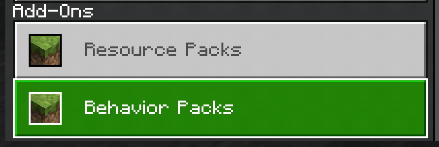

# Gametest `API` 
guide to begain with *new scripting api*, **The GameTest Framework** \!

---


  
[](https://github.com/WavePlayz/Gametest-API/actions/workflows/pages/pages-build-deployment)  


[**DOWNLOAD SAMPLE PACK**](https://github.com/WavePlayz/Gametest-API/releases/latest)  


---

## Prerequisites


- Basic understanding of **Javascript**, Some resources below.
  - Crash Course by Amazing instructor [**Mosh Hamedani**](https://codewithmosh.com/) (Highly Recommended)  
१ [Javascript in 1 hour](https://youtu.be/W6NZfCO5SIk)  
२ [ES6 / Modern Javascript in 1 Hour](https://youtu.be/NCwa_xi0Uuc)  
  - [W3schools](https://www.w3schools.com/js/js_statements.asp) (Recommended)
  - [Javascript info](https://javascript.info/)

-  **Android**, **IOS** or **Win10** device with Minecraft Bedrock Edition installed.
- Code editor
  - Desktop  
१ [Visual Studio Code (Recommended)](https://code.visualstudio.com/)  
२ [Sublime Text](https://www.sublimetext.com/)  

  - Android  
१ [QuickEdit (Recommended)](https://play.google.com/store/apps/details?id=com.rhmsoft.edit)  
२ [Squircle - Code Editor](https://play.google.com/store/apps/details?id=com.blacksquircle.ui)  

- Javascript executer - *optional but useful*
  - Android  
१ [JS Run (Preferred)](https://play.google.com/store/apps/details?id=com.mia.jsrun)  
२ [JavaScript Editor](https://play.google.com/store/apps/details?id=com.sorincovor.javascript_editor)  
३ [Termux quickjs](/guide/termux-quickjs-setup.md)


## Setup
##### Accessing Minecraft directory

The place where we will be spending most of our time.

**Win10**  
users can find this at 

- Minecraft: `%localappdata%\Packages\Microsoft.MinecraftUWP_8wekyb3d8bbwe\LocalState\games\com.mojang`
- Minecraft Preview: `%localappdata%\Packages\Microsoft.MinecraftWindowsBeta_8wekyb3d8bbwe\LocalState\games\com.mojang`

**Android**  
users can find this at 

`/Android/data/com.mojang.minecraftpe/files/games/com.mojang/`


**Android 10+** 
As per android restrictions, A-10 users won't be able to access the folder directly, this can be solved with file explorer, all you need is an external **File Manager** app which will allow you to locate those internal folders, some apps you can try...
- ES File Explore (Recommended) **Google it**
- [Solid Explorer](https://play.google.com/store/apps/details?id=pl.solidexplorer2)
- [Explorer](https://play.google.com/store/apps/details?id=com.speedsoftware.explorer)
- [X-plore](https://play.google.com/store/apps/details?id=com.lonelycatgames.Xplore)

> **Tip:** Create shortcuts to those directories for quick access.

next locate these folder that we will use during our the development
 - `development_behavior_packs`
 - `development_resource_packs`


## Getting Started

##### Creating folder 

To start with, first we need to create a folder in `development_behavior_packs` directory, folder structure will look like this

```
development_behavior_packs/
┗━• sample_pack/
    ┣━• scripts/
    ┇    ┗━• script.js
    ┣━• manifest.json
    ┗━• pack_icon.png
```
[**•** DOWNLOAD SAMPLE PACK](https://github.com/WavePlayz/Gametest-API/releases/latest)

next update our `manifest.json` in order to use the gametest framework

1. include this module in modules section with the type and entry point, this which will be the main file for our gametest
before 1.19.0.30
```json
{
	"description": "gametest-module",
	"type": "javascript",
	"uuid": "9e896681-01d8-4a21-b1e2-e350e3c9c1ae",
	"version": [0, 0, 1],
	"entry": "scripts/script.js"
}
```
after 1.19.0.30
```json
{
	"description": "gametest-module",
	"type": "script",
	"language": "JavaScript",
	"uuid": "9e896681-01d8-4a21-b1e2-e350e3c9c1ae",
	"version": [0, 0, 1],
	"entry": "scripts/script.js"
}
```
3. add gametest dependencies to make use of those within javascript files 
```jsonc
"dependencies": [
	{
		"description": "mojang-minecraft",
		"uuid": "b26a4d4c-afdf-4690-88f8-931846312678",
		"version": [0, 1, 0]
	},
	{
		"description": "mojang-gametest",
		"uuid": "6f4b6893-1bb6-42fd-b458-7fa3d0c89616",
		"version": [0, 1, 0]
	},
	{
		"description": "mojang-minecraft-server-admin",
		"uuid": "53d7f2bf-bf9c-49c4-ad1f-7c803d947920",
		"version": [0, 1, 0]
	},
	{
		"description": "mojang-minecraft-ui",
		"uuid": "2bd50a27-ab5f-4f40-a596-3641627c635e",
		"version": [0, 1, 0]
	},
	{
		"description": "mojang-net",
		"uuid": "777b1798-13a6-401c-9cba-0cf17e31a81b",
		"version": [0, 1, 0]
	}
]
```

##### manifest.json

a complete `manifest.json` will look something like this
```jsonc
{
	"format_version": 2,
	
	"header": {
		"name": "Example gametest behavior pack",
		"description": "Example gametest behavior pack",
		"uuid": "b3bc569d-3144-4473-82ae-c5704a6064e3",
		"version": [0, 0, 1],
		"min_engine_version": [1, 19, 10]
	},
	
	"modules": [
		{
			"description": "Example gametest behavior pack",
			"type": "script",
			"language": "javascript",
			"uuid": "9e896681-01d8-4a21-b1e2-e350e3c9c1ae",
			"version": [0, 0, 1],
			"entry": "scripts/script.js"
		}
	],
	
	"dependencies": [
		{
			"description": "mojang-minecraft",
			"uuid": "b26a4d4c-afdf-4690-88f8-931846312678",
			"version": [0, 1, 0]
		},
		{
			"description": "mojang-gametest",
			"uuid": "6f4b6893-1bb6-42fd-b458-7fa3d0c89616",
			"version": [0, 1, 0]
		},
		{
			"description": "mojang-minecraft-server-admin",
			"uuid": "53d7f2bf-bf9c-49c4-ad1f-7c803d947920",
			"version": [0, 1, 0]
		},
		{
			"description": "mojang-minecraft-ui",
			"uuid": "2bd50a27-ab5f-4f40-a596-3641627c635e",
			"version": [0, 1, 0]
		},
		{
			"description": "mojang-net",
			"uuid": "777b1798-13a6-401c-9cba-0cf17e31a81b",
			"version": [0, 1, 0]
		}
	]
}
```
##### Native modules

As of 1.19.0.27 we got 5 native modules to work with
- `mojang-gametest`
- `mojang-minecraft`  
- `mojang-minecraft-ui` (1.18.20.21+)
- `mojang-net` (1.19.0.32/33+)
- `mojang-minecraft-server-admin` (1.19.0.32/33+)

`mojang-gametest`
is the very first module but is not something to very excite about, its intended for game devlopers for automate game mechanics thus not very useful for creators plus it only works within the range of stucture blocks  

`mojang-minecraft`
on the other hand is something that we can consider as the "new scripting api" which the creators can utilze to create more powerful programed addons..

`mojang-minecraft-ui`
addition to beta 1.18.20.21, now provide us a way to create "server forms" like you see on featured minigame servers, with ActionForm, MessageForm and ModalForm user inputs can be more interactive

`mojang-net`
Minecraft's module for executing HTTP-based requests. This module can only be used on Bedrock Dedicated Server.

`mojang-minecraft-server-admin`
Minecraft's module for administering a Bedrock Dedicated Server. This allows Minecraft to modify configuration of variables and secrets in JSON files in the Bedrock Dedicated Server folder. Cannot be used on Minecraft clients.

##### Importing pack
now you can now load the pack into the world lets create a new one, in the game options turn on the **Enable Gametest Framework** option to make scripts run 


then head over to **Behavior Packs** section at the lower-left corner of the "Add-Ons" sub-menu. 



Click `Behavior Packs > My Packs`
your pack now should show up in the list of behavior packs!

Clicking the pack should show a button named "Activate". Click to active it.


your behavior pack now should have been moved to the "Active" section! 

now you can join the world to see everything works, but wait if you join you wont see anything diffrent its obvious since we have nothing added in the script file yet


##### creating our first script

the very first thing we need to do in the script is to import the native minecraft modules like that
```js
// importing native minecraft module
import * as Minecraft from "mojang-minecraft"
```
next we need to listen for some event, in this tutorial we will use the tick event which runs every tick, here is how you do it
```js
Minecraft.world.events.tick.subscribe(eventData => {
	const { currentTick } = eventData
	
	// your code here

})
```

##### chat spam, our first script


lets create chat spam as our first script to see if everything is all right
```js

// importing native minecraft module
import * as Minecraft from "mojang-minecraft";

// variable to track world is empty or filled
let worldHasPlayer = false 

// player join event triggered when a player joins
Minecraft.world.events.playerJoin.subscribe(player => {
	
	// as player has joined set worldHasPlayer to yes
	worldHasPlayer = true
})

const TICKS_IN_FIVE_SECONDS = 20 * 5

// world tick event that fires our function every tick - 20 time in a sec
Minecraft.world.events.tick.subscribe(eventData => {

	// current world tick count value returned by the event
	const { currentTick } = eventData
	
	// if world not has player or current tick is not divisable by TICKS_IN_FIVE_SECONDS then break the code
	if (!worldHasPlayer || currentTick % TICKS_IN_FIVE_SECONDS !== 0) return;
	
	// get all players 
	let players = Minecraft.world.getPlayers()
	
	// loop through players 
	for (let player of players) {
		// run command as player 
		player.runCommand("say Hello " + player.nameTag)
	}
})
```

save the code in your `script.js` / main file then open the world, you should now see a spam in the chat.. if not then something is wrong :( recheck what went wrong.


