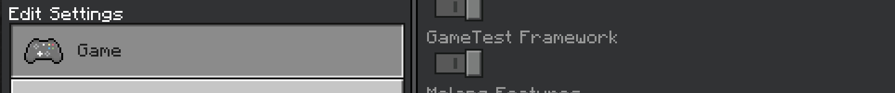

# Into to Bedrock Script API 
---

## Prerequisites

- Basic understanding of **JavaScript**
  - Crash Course by Amazing instructor [**Mosh Hamedani**](https://codewithmosh.com/) (Highly Recommended)  
१ [Javascript in 1 hour](https://youtu.be/W6NZfCO5SIk)  
२ [ES6 / Modern Javascript in 1 Hour](https://youtu.be/NCwa_xi0Uuc)  
  - [W3Schools](https://www.w3schools.com/js/js_statements.asp) (Recommended)
  - [JavaScript Info](https://javascript.info/)

- An **Android**, **IOS** or **Windows 10+** device with Bedrock installed.
- Code editor
  - Desktop  
१ [Visual Studio Code](https://code.visualstudio.com/) (Recommended)  
२ [Sublime Text](https://www.sublimetext.com/)  

  - Android  
१ [QuickEdit](https://play.google.com/store/apps/details?id=com.rhmsoft.edit) (Recommended)  
२ [Squircle - Code Editor](https://play.google.com/store/apps/details?id=com.blacksquircle.ui)  

  - IOS

a javascript executer can be helpful for logic building and testing, listing some recommendation
  - Android  
१ [JS Run](https://play.google.com/store/apps/details?id=com.mia.jsrun) (Preferred)  
२ [JavaScript Editor](https://play.google.com/store/apps/details?id=com.sorincovor.javascript_editor)  
३ [Termux quickjs](/guide/termux-quickjs-setup.md)

---

## Setup
##### The minecraft directory

The place where we will be spending most of our time.

**Win10**  
- Minecraft: `%localappdata%\Packages\Microsoft.MinecraftUWP_8wekyb3d8bbwe\LocalState\games\com.mojang`
- Minecraft Preview: `%localappdata%\Packages\Microsoft.MinecraftWindowsBeta_8wekyb3d8bbwe\LocalState\games\com.mojang`

**Android**  
- `/Android/data/com.mojang.minecraftpe/files/games/com.mojang/`


> **Android 10+**  
> As per new android storage restrictions, users are not allowed to access /Android/* folders, but due to a bug this can be solved by using a custom file manager app which exploits the bug and let you access those internal folders. Apps you can try...
> - ES File Explore (Recommended) **Google it**
> - [Solid Explorer](https://play.google.com/store/apps/details?id=pl.solidexplorer2)
> - [Explorer](https://play.google.com/store/apps/details?id=com.speedsoftware.explorer)
> - [X-plore](https://play.google.com/store/apps/details?id=com.lonelycatgames.Xplore)

> **Tip:** Create shortcuts to those directories for quick access.

#### Development folders
next locate these folders that we will be using during the development
 - `development_behavior_packs`
 - `development_resource_packs`


## Getting Started

##### Folder Structure 

To start with, first we will need to create a folder inside `development_behavior_packs` directory.

the structure of the folder will look something like this

```
development_behavior_packs/
┗━• sample_pack/
    ┣━• scripts/
    ┇    ┗━• script.js
    ┣━• manifest.json
    ┗━• pack_icon.png
```

[**•** DOWNLOAD SAMPLE PACK](https://github.com/WavePlayz/Gametest-API/releases/latest)

##### Manifest
next our `manifest.json` file will be like this

```jsonc
{
	"format_version": 2,
	
	"header": {
		"name": "My Script Pack",
		"description": "demo script pack",
		"uuid": "b3bc569d-3144-4473-82ae-c5704a6064e3",
		"version": [0, 1, 0],
		"min_engine_version": [1, 19, 40]
	},
	
	"modules": [
		{
			"description": "script-api",
			"type": "script",
			"language": "javascript",
			"uuid": "9e896681-01d8-4a21-b1e2-e350e3c9c1ae",
			"version": [0, 1, 0],
			"entry": "scripts/script.js"
		}
	],

	// allows the use of eval() and Function() in scripts since 1.19.40.x
	"capabilities": [ "script_eval" ]

	"dependencies": [
		{
			"description": "mojang-minecraft",
			"uuid": "b26a4d4c-afdf-4690-88f8-931846312678",
			"version": "1.0.0-beta"
		},
		{
			"description": "mojang-minecraft-ui",
			"uuid": "2bd50a27-ab5f-4f40-a596-3641627c635e",
			"version": "1.0.0-beta"
		}
	]
}
```

# list of other script modules
```jsonc
{
	"description": "mojang-gametest",
	"uuid": "6f4b6893-1bb6-42fd-b458-7fa3d0c89616",
	"version": "1.0.0-beta"
},
{
	"description": "mojang-minecraft-server-admin",
	"uuid": "53d7f2bf-bf9c-49c4-ad1f-7c803d947920",
	"version": "1.0.0-beta"
},
{
	"description": "mojang-net",
	"uuid": "777b1798-13a6-401c-9cba-0cf17e31a81b",
	"version": "1.0.0-beta"
}
```

##### Native modules

As of 1.19.40.23 we got 5 native modules to work with
- `@minecraft/server-gametest`
- `@minecraft/server`  
- `@minecraft/server-ui` (1.18.20.21+)
- `@minecraft/server-net` (1.19.0.32/33+)
- `@minecraft/server-admin` (1.19.0.32/33+)

`@minecraft/server-gametest` or `mojang-gametest`
is the very first module but is not something to very excite about, its intended for game devlopers for automate game mechanics thus not very useful for creators plus it only works within the range of stucture blocks  

`@minecraft/server` or `mojang-minecraft`  
on the other hand is something that we can consider as the "new scripting api" which the creators can utilze to create more powerful programed addons..

`@minecraft/server-ui` or `mojang-minecraft-ui`
addition to beta 1.18.20.21, now provide us a way to create "server forms" like you see on featured minigame servers, with ActionForm, MessageForm and ModalForm user inputs can be more interactive

`@minecraft/server-net` or `mojang-net`
Minecraft's module for executing HTTP-based requests. This module can only be used on Bedrock Dedicated Server.

`@minecraft/server-admin` or `mojang-minecraft-server-admin`
Minecraft's module for administering a Bedrock Dedicated Server. This allows Minecraft to modify configuration of variables and secrets in JSON files in the Bedrock Dedicated Server folder. Cannot be used on Minecraft clients.

##### Importing pack
next load the pack into the world and make sure to enable "Enable Gametest Framework" in the world options to allow API for that world



##### First script

1. The very first thing we need is to import the native server module
2. Next, we listen to some event, here in the tutorial we are using `system.run` to create a tick loop that runs every tick
3. Then, we send a message inside the event

```js

// #1 step
import * as server from "@minecraft/server"


// #2 step
const system = server.system

function tickEvent (eventData) {
    const { currentTick } = eventData
    
    
    // #3 step
    server.world.say( "hello world" )
}

system.run( function run (eventData) {
    try {
        tickEvent( eventData )
    } catch {}
    
    system.run(run)
} )
```
and done! thats our first script, the chat spam script.

save the code in `script.js` file and open the world, if everything right you will see a chat spam congrats! if not? report WavePlayz#7915 on Discord for help and issues, Thanks!


